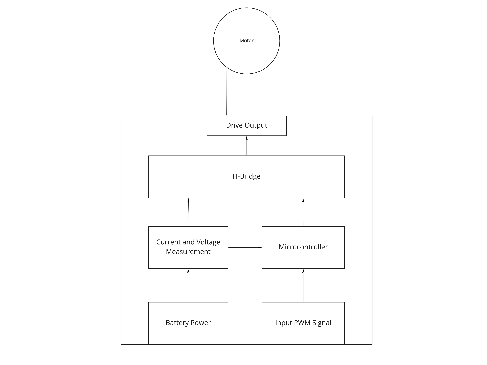

# newton-firmware

This is the firmware for the Atmel  Blue Robotics Newton Robotic Gripper. This project depends on the [Arduino IDE](https://www.arduino.cc/en/Main/Software) and the [ATTiny Core](https://github.com/SpenceKonde/ATTinyCore).

#### Hardware

The schematic and hardware design files for the Newton Gripper are not publicly available. Instead, a simplified block diagram is provided:

